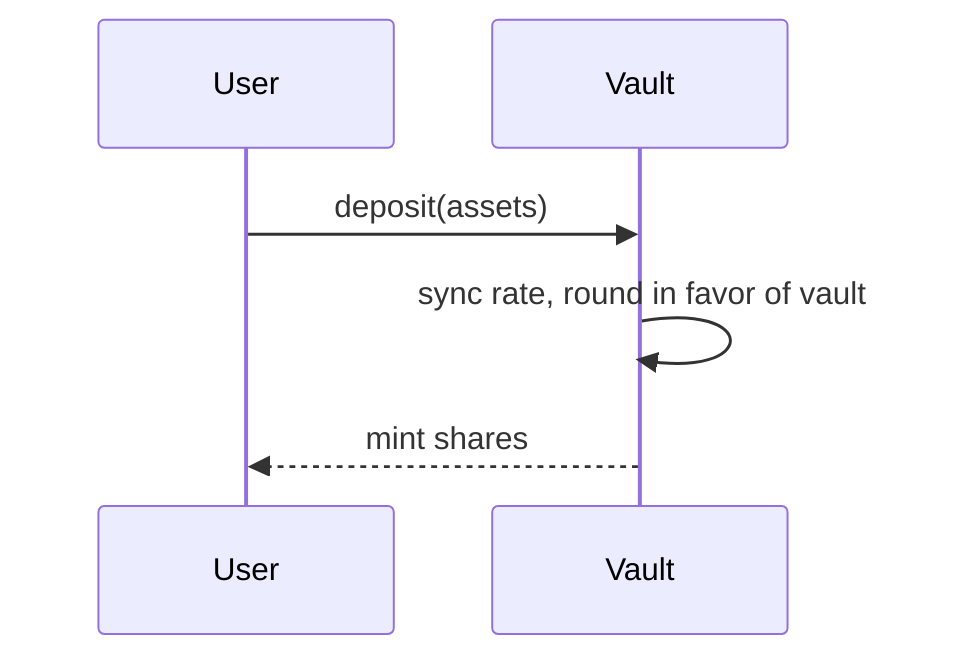

# Visual Aids

Some concepts land far better as a picture — control/data flow, state machines, account & PDA relationships, fee/rate math, attack timelines, before/after refactors. Reach for a visual when a concept is structural, sequential, or numeric; skip it for simple facts.

The learner's preference is captured once in `.teach.md` (`style`). If they're a visual learner, lean into diagrams by default; if text, keep visuals minimal and on request.

## Default: mermaid embedded in the note

Prefer a mermaid diagram inside the study note. It's durable, lives with the note, and renders in both Obsidian (native) and Notion (mermaid code block). Use it for most diagrams. One idea per diagram, with a one-line caption.



## On demand: interactive HTML explainer

For a genuinely complex or highly visual topic — or whenever the learner asks — generate a standalone HTML explainer. Quality bar:

- Clean and focused; one topic, not a textbook.
- Cited — link every non-obvious claim to a source (`file:line`, an ADR, a doc URL).
- Interactive — "try this" callouts, and where it fits, an embedded self-check quiz.
- Self-contained — inline CSS/JS, renders offline in any browser.
- Adheres to the repo's `CONTEXT.md` terminology if it exists.

### Where it's saved and how to open

- **Obsidian**: save to `<VAULT>/Learning/<project>/<subject>/<topic>.html` (beside the note) and link it from the note.
- **Notion / no-notes**: save to a scratch path (`.claude/teach-explainers/<topic>.html`) and link it; Notion can't embed local HTML.

Open it for the learner (cross-platform):

```bash
open "<path>"                              # macOS
xdg-open "<path>"                          # Linux
explorer.exe "$(wslpath -w "<path>")"      # WSL
```

An explainer is an *input* to understanding, not evidence of it. Don't let it replace the loop — still restate, drill the whys, and quiz.
